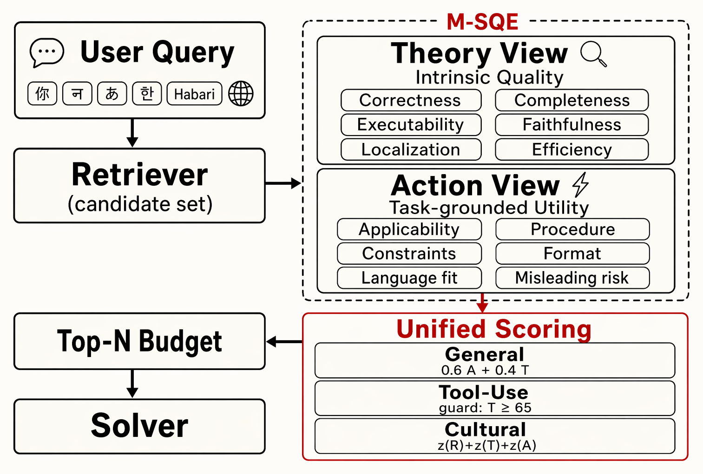

<div align="center">

# M-SQE: Multilingual Skill Quality Estimation

**Beyond retrieval relevance — a post-retrieval quality estimator that scores candidate agent skills for multilingual and cross-cultural agent skill use.**

</div>

---

## 📣 Introduction

Community-maintained **agent skill** libraries — reusable procedural documents that extend LLM agents beyond their parametric memory — are growing fast, but they remain deeply English-centric. For low-resource languages, retrieval often returns a skill written in a different language than the query, or a synthesized in-language skill whose quality is unreliable, so **retrieval relevance alone frequently surfaces a related but unusable candidate**.

**M-SQE** is a lightweight, post-retrieval **quality estimation** layer. Given a query and its retrieved candidate skills, it routes the query to a domain, scores each candidate from two complementary views, and merges them with a domain-specific rule into a single ranked score:

<div align="center">

</div>

- **Router** — a 5-shot task-type router classifies the query into `general`, `tool` (function calling), or `culture`, selecting the domain-specific scorers and combine rule.
- **Theory view** — intrinsic quality of the skill document, judged *without* the task, on six dimensions with a red-line / basic / advanced level cap.
- **Action view** — task-specific expected utility of the candidate for the query at hand, together with a misleading-risk term.
- **Combine** — the two views are merged by the combine rule of the routed domain (table below).

| Domain | Combine rule |
|---|---|
| General | `0.6 · expected_utility + 0.4 · theory_overall`, descending |
| Tool | Action order, with `theory_overall ≥ 65` and no language violation promoted to the front |
| Culture | `z(retrieval) + z(theory) + z(action)` (population std), descending |

This repository releases the scoring components, a stdlib-only reference runner, and the three-domain evaluation data (skill pools, tasks, and deterministic checkers) used in the paper.

---

## 🔰 Installation

```bash
git clone https://github.com/lunyiliu/M-SQE.git
cd M-SQE
```

The reference runner needs **Python 3.9+ and only the standard library** — no `pip install` required. Point it at any OpenAI-compatible chat-completions endpoint:

```bash
export MSQE_API_BASE=https://api.example.com/v1   # OpenAI-compatible endpoint
export MSQE_API_KEY=sk-...                         # bearer token for that endpoint
export MSQE_MODEL=...                              # optional: overrides each scorer's request-spec model
```

---

## 🚀 Quickstart

`code/main.py` is a reference runner that wires the released components end to end for one query and a small set of candidate skills: **query → router → Theory/Action scoring → combine → a printed, ranked score table.**

```bash
cd code
python3 main.py ../examples/general_example.json
python3 main.py ../examples/tool_example.json
python3 main.py ../examples/culture_example.json
python3 main.py ../examples/general_example.json --domain general   # skip routing, force a domain
```

Each run prints the routed domain and a ranked table of `final` / `theory` / `action` scores per candidate `skill_id`:

```
query: Excelの「売上データ」シートの...
routed domain: general

rank     final   theory   action  skill_id
1         57.0     97.5       30  general_pool:145
2         39.7     99.2        0  general_pool:168
3         39.3     98.3        0  general_pool:154
```

(Exact scores depend on the model behind the endpoint; the table shape and column meaning stay fixed.) See [`code/README.md`](code/README.md) for the full module reference and input contracts.

---

## 🗂️ Evaluation data

`data/` holds the three-domain evaluation substrate used in the paper, released under CC-BY 4.0.

| Domain | Skill pool | Tasks | Description |
|---|---|---|---|
| General | `data/pools/general_pool.jsonl` (1,750) | `data/tasks/general_tasks.jsonl` (94) | ecological-style, MT, and self-generated production layers |
| Tool | `data/pools/tool_pool.jsonl` (2,299) | `data/tasks/tool_tasks.jsonl` (265) | function calling over a 55-function inventory |
| Culture | `data/pools/culture_pool.jsonl` (5,285) | `data/tasks/culture_tasks.jsonl` (52) | short-answer tasks over six culture regions |

Each pool record is one candidate skill:

```json
{"id": 145, "body": "---\nname: ...\ndescription: ...\n---\n<skill document>", "locale": "hi", "production_layer": "ecological"}
```

**Deterministic graders.** `data/checkers/{general,tool,culture}_checker.py` are the deterministic, dependency-free task graders used to score downstream task success, so evaluation does not depend on an LLM judge. See [`data/README.md`](data/README.md) for the task schema and grader contracts.

---

## 📐 Scoring your own candidates

`code/main.py` documents the candidate input format at the top of the file: a `query`, a list of `candidates` (each with `skill_id` / `body` / `locale` and an optional `retrieval_score`), and a `function_inventory` for the Tool domain. The three files in `examples/` are complete, runnable inputs — one per domain — you can copy and adapt.

---

## 📁 Repository layout

```
M-SQE/
├── code/
│   ├── router.py                     # 5-shot task-type router contract + parser
│   ├── tau_router_5shot_freeze.json  # frozen router prompt / few-shot examples
│   ├── general_theory.py             # Theory-view scorer (general)
│   ├── general_action.py             # Action-view scorer (general)
│   ├── tool_theory.py                # Theory-view scorer (tool)
│   ├── tool_action.py                # Action-view scorer (tool)
│   ├── culture_scorer.py             # Theory + Action scorers (culture)
│   ├── combine_general.py            # combine rule: 0.6·A + 0.4·T
│   ├── combine_tool.py               # combine rule: guarded Action order
│   ├── combine_culture.py            # combine rule: equal-weight z-scores
│   ├── tool_base_helpers.py          # shared helpers
│   ├── scorer_request_specs.json     # per-scorer request parameters
│   ├── main.py                       # stdlib-only reference runner
│   └── README.md                     # full module reference
├── data/
│   ├── pools/                        # candidate skill pools (3 domains)
│   ├── tasks/                        # evaluation tasks (3 domains)
│   ├── checkers/                     # deterministic task graders
│   └── README.md
├── examples/                         # one runnable input per domain
├── LICENSE                           # MIT (code)
└── data/LICENSE                      # CC-BY 4.0 (data)
```

---

## 📜 Citation

This work is under review. A citation entry will be added upon publication.

```bibtex
@misc{msqe,
  title  = {M-SQE: Multilingual Skill Quality Estimation for Enhancing Language Equality in Agentic Skill Use},
  note   = {Under review},
  year   = {2026}
}
```

## License

Code is released under the **MIT License** (see [`LICENSE`](LICENSE)); the evaluation data under **CC-BY 4.0** (see [`data/LICENSE`](data/LICENSE)).
